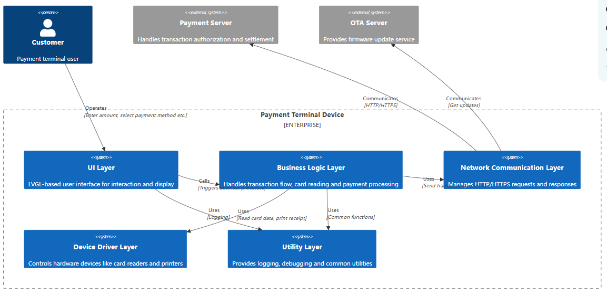
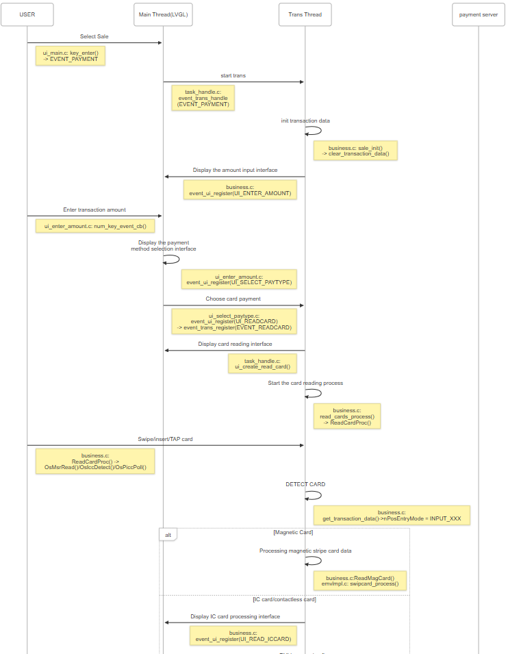
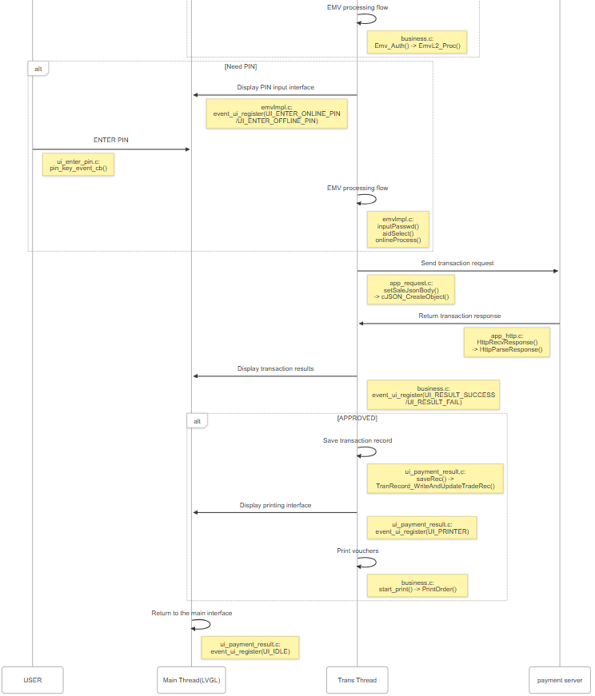

# Qpos SDK - LVGL Demo

Release 1.0.0

This repository provides a comprehensive implementation of a payment terminal application that enables you to process credit and debit card payments (including VISA, MasterCard, American Express and more) with a modern touchscreen interface.

The Qpos lvgl_demo is a standalone POS solution with connectivity capabilities via Wi-Fi and 4G/2G. The payment application runs directly on the terminal itself. The device integrates multiple processing components: a main application processor, a secure element for cryptographic operations, and connectivity modules. The main processor handles the user interface and application logic, while the secure processor manages communication with payment cards and secure operations. The connectivity modules provide network capabilities.

The application architecture follows a modular design with several key components:

## 1.Core Modules

- Business Logic Layer : Handles transaction processing, card reading, and payment record management. It provides implementations for all transaction types and payment flows.

- EMV Processing Layer : Implements EMV-compliant transaction processing for contact and contactless payments. It handles card authentication, cryptographic operations, and secure PIN entry.

- UI Layer : Built with LVGL graphics library, providing a modern touchscreen interface with multiple screens for payment flow, settings, and transaction management.

- Network Layer : Implements HTTP/HTTPS communication for transaction processing, enabling secure connections to payment processors.

- Resource Management : Handles UI assets, payment network logos, and system resources.
  
  ### The application supports multiple payment methods:

- Contact EMV (chip) cards

- Contactless NFC payments

- Magnetic stripe cards
  
  ### Key features include:

- Amount entry with numeric keypad

- Multiple payment type selection

- PIN entry (online and offline)

- Transaction result display

- Settings management (time, network, display)

- Transaction history

- Status indicators for connectivity and battery

The project uses CMake for building and includes all necessary libraries for payment processing, cryptography, and UI rendering. The code is structured to be maintainable and extensible, allowing for easy addition of new payment methods or features.

For more information about the D30 payment terminal and its capabilities, please refer to the project documentation.

## 2.Technical Overview

## Application Architecture

This diagrams describes the general software architecture.



The following is a complete card transaction process, with key function codes annotated.





## 3 TMS

The demo already supports dspread tms,TMS supports MQTT push update task function.Please refer to [app_ota. c]((https://github.com/DspreadOrg/D30-linux/blob/main/app_demo/src/ota/ota.c)).If TMS access and credentials are required, please contact technical personnel

```
void TmsDispCallback(u32 id, char *pMsg)
{
    u32 i ;
    char dispBuff[8] = {0};
    int curValue = 0;
    OsLog(LOG_DEBUG,"Dspread: %s:id=%d",__FUNCTION__,id);
    switch(id)
    {
        case TMS_DISP_START_CHECK:
            GuiEventRegister(LCD_DISP_OTA_CHECK);
            break;
        case TMS_DISP_START_DOWNLOAD:
            GuiEventRegister(LCD_DISP_OTA_DOWNLOAD_DISP);
            break;
        case TMS_DISP_DOWNLOADING_PROGRESS:
            process = atoi(pMsg);
            GuiEventRegister(LCD_DISP_OTA_DOWNLODING);
            break;
        case TMS_DISP_UPGRADING:
            GuiEventRegister(LCD_DISP_OTA_UPGRADING);
            break;
        case TMS_DISP_HAVE_UPDATE_TASE:
            GuiEventRegister(LCD_DISP_OTA_FIRMWARE_NEED_DOWNLOAD);
            break;
        default:
            break;
    }

}

void larktms_init()
{
    static LarkTmsCallBack_t larktmsCbk;
    larktmsCbk.ssl_connect = ssl_server_connect;
    larktmsCbk.ssl_disconnect= ssl_server_disconnect;
    larktmsCbk.ssl_send = ssl_send_msg;
    larktmsCbk.ssl_recv = ssl_recv_msg;

    larktms_service_start(&larktmsCbk,TmsDispCallback,TMS_FW_HEART_CUSTOM_URL,APP_VERSION);
}
```

'larktms_service_start'  will start a tms mqtt thread.

## 4.LinuxSdk Api

### 4.1 Thread Api

#### 4.1.1Main Thread

appStart() is the main thread. Be used to drawing UI

```main.c
int main(int argc, char *argv[])
{
    PR_INT32 ret;
    ymframwork_init(argc, argv);//system api
      Disp_vRegisterPauseCallBack(lvgl_disp_pause);
    Disp_vRegisterResumeCallBack(lvgl_disp_resume);
    Disp_vInit(); //UI  init
    Disp_vSetStatusBarStatus(0);
    OsSetSysSleepStatus(1); //Temporarily set to not allow hibernation

    char szAppId[] = "linux_pos_app";
    OsLogSetTag(szAppId);  //set logcat tag
    DB_bInit(szAppId); //database init
    signalHandle();
    EmvL2_Init();
    thread_init();
    if (pthread_create(&lvgl_tick_tid, NULL, tick_thread, NULL) != 0)
        printf("can't create thread\n");

    larktms_init();
    appStart();
    ymframwork_finish(ret);//system api
    return 0;
}
 void appStart()
{
    if(lvgl_Queue_Init() != PR_NORMAL)
    {
        exit(1);
    }

    lvgl_init();
    devInit();
    GuiDisplay(LCD_DISP_WELCOME);

    queue_message_body_t queMsg;
    int ret = 0;
    while(1)
    {
        memset(&queMsg,0,sizeof(queue_message_body_t));
        ret = -1;
        ret = msgrcv(Lvgl_Queue_Id, &queMsg, sizeof(queue_message_body_t)-sizeof(long), 1, IPC_NOWAIT);
        if (ret != -1)
        {
            GuiDisplay(queMsg.msg.msg_id);
        }
        else
        {
            lv_task_handler();
        }
        OsSleep(CFG_LVGL_MS_PER_TICK);
    }
} 
```

#### 4.1.2 Trans thread

This thread is used to execute transactions or perform time-consuming operations, such as searching for WIFI.

```ui_main.c
void *event_trans_thread(void *args)
{
    message_body_t msg;
    int ret = 0;

    key_t key;
    char *file = "/tmp/event_msg";
    FILE *fp = fopen(file, "w");
    if (fp != NULL)
    {
        fclose(fp);
    }

    // Create a unique key
    key = ftok("/tmp/event_msg", 'm');
    if (key == -1) {
        return NULL;
    }

        // Create a message queue
    Event_Queue_Id = msgget(key, IPC_CREAT | 0666);
    if (Event_Queue_Id == -1) {
        DSP_Info("Event_Queue_Id create failed");
        return NULL;
    }
    while(1)
    {
        memset(&msg,0,sizeof(message_body_t));
        ret = -1;
        ret = msgrcv(Event_Queue_Id, &msg, sizeof(message_body_t), 0, 0);
        if (ret != -1)
        {
            event_trans_handle(msg.msg_id);
            event_thread_mutex(MUTEX_OFF);    
        }
        OsSleep(10);
    }

}
```

### 4.2 Emv Api

Below are the initialization and startup functions related to EMV.

```emvlmpl.c
static void Initialize_EMV_CallBackFun(EmvCallBack_t *pcallbackfun)
{
    pcallbackfun->EMV_AidSelect = aidSelect;
    pcallbackfun->EMV_ConfirmCardInfo = confirmCardInfo;
    pcallbackfun->EMV_InputPasswd = inputPasswd;
    pcallbackfun->EMV_CertConfirm = certConfirm;
    pcallbackfun->EMV_ProcessDisp = emv_process_disp;
    pcallbackfun->EMV_OnlineProcess = onlineProcess;
    pcallbackfun->EMV_AfterSelectApp = NULL;
    pcallbackfun->EMV_AfterReadRecord = NULL;
    pcallbackfun->EMV_SetKernelId = NULL;
}

PR_INT32 EmvL2_Init(){
    EmvTermConfig_t termconfig;
    EmvCallBack_t t_callbackfun;

    Initialize_EMV_CallBackFun(&t_callbackfun);
    Initialize_EMV_TermConfig(&termconfig);
    if(Emv_KernelInit(termconfig,t_callbackfun) < 0){
        OsLog(LOG_DEBUG,"emv init fail\n");
        return PR_FAILD;
    }
    return PR_NORMAL;
}

PR_INT32 EmvL2_Proc(EmvTransParams_t emvTransParams){
    EMV_L2_Return nEmvRet = APP_RC_START;

    nEmvRet = Emv_Process(emvTransParams);
    return nEmvRet;
}
```

During the processing of EMV transactions, the following callback functions may be executed

```emvlmpl.c
int emv_process_disp(EmvKernelDisp type)
{

    switch (type)
    {
    case EMV_DISP_READING_CARD:
        event_ui_register(UI_READ_ICCARD);
        break;
    case EMV_DISP_SEE_PHONE:
        event_ui_register(UI_SEE_PHONE);
        OsSleep(5000);
        break;
    case EMV_DISP_REMOVE_CARD:
        event_ui_register(UI_REMOVE_CARD);
        break;
    case EMV_DISP_NFC_RETAP:
        event_ui_register(UI_NFC_RETAP);
        break;
    default:
        break;
    }
    return 0;
} 
```

inputPasswd() is the emv callback for pin.It includes both online and offline pins.

```
int inputPasswd(int type, char *pszPin){
    int ret ;
    unsigned char pinKsn[16] = {0};

    if(type == EMV_ONLINEPIN_INPUT)
    {
        get_transaction_data()->emv_emter_online_pin_result =0xFF;
        event_ui_register(UI_ENTER_ONLINE_PIN);
        ret = OsPedOpen();
        if(ret != RET_OK)
        {
            return PR_FAILD;
        }

        ret = OsPedIncreaseKsnDukpt(PED_PIN_IPEK_INDEX);
        if(ret != RET_OK){
            OsCloseSoftKeyboard ();
            return PR_FAILD;
        }
        ret = OsPedGetPinBlockDukptBySoftKeyboard(PED_PIN_IPEK_INDEX,get_transaction_data()->sCardNo, 4, 6, 60*1000,get_transaction_data()->sPinKsn, pszPin,disp_mask_pin);
        OsLog(LOG_DEBUG,"--------OsPedGetPinBlockDukptBySoftKeyboard ret = %d",ret);
        OsCloseSoftKeyboard ();
        if(ret == RET_OK)
        {
            get_transaction_data()->emv_emter_online_pin_result = 1;
            memcpy(get_transaction_data()->sPin,pszPin,8);
        }
    }
    else
    {
        event_ui_register(UI_ENTER_OFFLINE_PIN);
        get_transaction_data()->emv_enter_offline_pin_result = 0xFF;
        while(get_transaction_data()->emv_enter_offline_pin_result == 0xFF)
        {
            OsSleep(100);
        }

        if(get_transaction_data()->emv_enter_offline_pin_result == 0) //offline pin enter
        {
            memcpy(pszPin,get_transaction_data()->sPin,strlen(get_transaction_data()->sPin));
            ret = strlen(get_transaction_data()->sPin);
        }
        else
        {
            ret = -1;
        }
    }
    return ret;
}
```

aidSelect() is the emv callback for application selection.

```
int aidSelect(AidCandidate_t *pList, int listNum){

    unpackAppsName(listNum,pList);
    event_ui_register(UI_MULTI_APP_SELECT);
    get_transaction_data()->emv_multi_app_select_result = 0xFF;
    while(get_transaction_data()->emv_multi_app_select_result == 0xFF)
    {
        OsSleep(100);
    }
    event_ui_register(UI_READ_ICCARD);
    return get_transaction_data()->emv_multi_app_select_result;
}
```

onlineProcess() is the emv callback for online request.

```
int onlineProcess(EmvOnlineData_t* pOnlineData){
    event_ui_register(UI_PROCESSING);
    Emv_GetCardInfo(get_transaction_data());
    sale_online_request(pOnlineData);
    return PR_NORMAL;
}
```

When the EMV trading process is completed, the following results will be obtained.

```emvdeviceimpl.c
// emv transaction return value
typedef enum
{
    APP_RC_START = -1,
    APP_RC_COMPLETED = 0,
    APP_RC_TERMINAL,
    APP_RC_CANCEL,
    APP_RC_EMV_DENAIL,
    APP_RC_EMV_GAC2_DENAIL,
    APP_RC_NFC_NOT_ALLOW,
    APP_RC_EMV_APP_BLOCK,
    APP_RC_EMV_APP_SEE_PHONE,
    APP_RC_EMV_TRANS_TRY_ANOTHER_INTERFACE,
    APP_RC_EMV_TRANS_GPO_NOT_SUPPORT,
    APP_RC_FALL_BACK,
    APP_RC_EMV_CARD_BLOCK,
    APP_RC_CARD_NOT_SUPPORT,

    APP_RC_NFC_RETAP_TIMEOUT,
    APP_RC_NFC_RETAP_CANCEL,
    APP_RC_NFC_TERMINAL,
    APP_RC_NFC_DOUBLETAP_DENAIL,
    APP_RC_NFC_MULTI_CARD,
    APP_RC_NFC_TRY_AGAIN,
    APP_RC_TRANS_REVERSEL,
    APP_RC_NUMS,
}EMV_L2_Return;
```

When executing the issuer script during the contactless transaction process, it is necessary to call 'Emv_SetOnlineResult' api.Please note 'APP_POLL_CTL_MODE' or 'KERNEL_POLL_CTL_MODE' will control the card search mode

```
PR_INT32 EmvL2_Proc(EmvTransParams_t emvTransParams){
    EMV_L2_Return nEmvRet = APP_RC_START;
    int ret = PR_FAILD;

    nEmvRet = Emv_Process(emvTransParams);
    if(emvTransParams.icc_type == CONTACTLESS_ICC && nEmvRet == APP_RC_COMPLETED)
    {
        // do contactless trans online request
        EmvOnlineData_t emvOnlineData;
        memset(&emvOnlineData,0,sizeof(EmvOnlineData_t));
        ret = onlineProcess(&emvOnlineData);
        if(ret == PR_NORMAL)
        {
            if(memcmp(emvOnlineData.iccResponse,"00",2) == 0 && emvOnlineData.ackdatalen > 0)
                ret = Emv_SetOnlineResult(KERNEL_POLL_CTL_MODE,&emvOnlineData);
        }

        if(ret == PR_NORMAL)
            nEmvRet = APP_RC_COMPLETED;
        else
            nEmvRet = APP_RC_TERMINAL;
    }
    return nEmvRet;
}
```

If you have special requirements during EMV trading, you can complete them through the following three callback functions

```
    pcallbackfun->EMV_SetKernelId = updateKernelId;
```

Forcefully modify the kernel that needs to be executed

```
pcallbackfun->EMV_AfterSelectApp = updateTagAfterSelectApp;
pcallbackfun->EMV_AfterReadRecord = updateTagAfterRea
```

Force modification of TAG values

### 4.3 Network Api

#### 4.3.1 Wifi

Use the OsWifiScan() to search wifi list.

```
void wifi_search()
{
    PR_INT32 res = 1;
    PR_INT32 i, num,ret;

    PR_INT32 rssi,nIndexOfSelect;
    if(gAps != NULL){
        free(gAps);
        gAps = NULL;
    }

    num = OsWifiScan (&gAps);
    if(num <= 0){
        OsLog(LOG_DEBUG,"Dspread: OsWifiScan ret = %d",num);
        set_fail_msg("Search fail");
        event_ui_register(UI_RESULT_FAIL);
    }
    else
    {
        wifi_ap_num = num;
        event_ui_register(UI_DISP_WIFI_LIST);
    }
}
```

Use the OsWifiConnect() to connect the WiFi hotspot.

```
void wifi_connect()
{
    ST_WifiApSet Ap;
    PR_INT32 rssi,ret,nIndexOfSelect,lvl;

    OsLog(LOG_ERROR,"Dspread: connect to  %d【%s】 pwd 【%s】 \n",sel_idx,gAps[sel_idx].Essid,wifi_pwd);
    memset(&Ap,0x0,sizeof(ST_WifiApSet));

    memcpy(Ap.Essid,gAps[sel_idx].Essid,strlen(gAps[sel_idx].Essid));
    memcpy(Ap.KeyUnion.PskKey.Key,wifi_pwd,strlen(wifi_pwd));
    Ap.KeyUnion.PskKey.KeyLen = strlen(wifi_pwd);
    Ap.AuthMode = gAps[sel_idx].AuthMode;
    Ap.SecMode = gAps[sel_idx].SecMode;
    memcpy(Ap.Bssid,gAps[sel_idx].Bssid,strlen(gAps[sel_idx].Bssid));
    ret = OsWifiConnect(&Ap,10*1000);
    OsLog(LOG_DEBUG,"OsWifiConnect ret = %d",ret);
    if(ret != 0){
        set_common_msg(1,"Connect fail");
        event_ui_register(UI_DISP_COMMON_MSG);
    }
    else
    {
        OsWlSetAutoConnectStatus(1);
        set_common_msg(0,"Connect Success");
        event_ui_register(UI_DISP_COMMON_MSG);
    }
}
```

#### 4.3.2 Cellular

Insert your SIM card and use the `OsWlCheck()` to check to cellular network.

If your SIM card needs to configure APN to connect to the network, you need to call `OsSetApnParams()` to set apn.

```
void apn_cfg()
{
    int ret = 0;
     if(strlen(user_name) >0 && strlen(user_pwd) > 0)
        ret = OsSetApnParams(apn,user_name,user_pwd);
     else   
        ret = OsSetApnParams(apn,NULL,NULL);
     OsLog(LOG_DEBUG," set apn ret = %d",ret );
}
```

### 4.4 Https Request Api

In demo app,sale_online_request() is a online request demo.

```
int sale_online_request(EmvOnlineData_t* pOnlineData)
{
    int ret = PR_FAILD;
    pu8 body=NULL;
    pu8 pSend=NULL;
    pu8 pRecv=NULL;
    s32    RecvLen=0;
    u32    HeadLen=0;
    u32    bodyLen = 0;
    u8 url[128] = {0};
    u32 urlLen = 0;

    body=(pu8)malloc(SERVER_REQUEST_BODY_LENGTH);
    pSend=(pu8)malloc(SERVER_REQUEST_LENGTH);
    memset(body,0,SERVER_REQUEST_BODY_LENGTH);
    memset(pSend,0,SERVER_REQUEST_LENGTH);

    bodyLen = setSaleJsonBody(body);
    OsLog(LOG_DEBUG,"body[%d] \n %s",bodyLen,body);

    RequestPackHttpFrame(body,URL_TEST,"POST",pSend,NULL,SERVER_REQUEST_LENGTH);


    pRecv=(pu8)malloc(SERVER_RECV_LENGTH);
    memset(pRecv,0,SERVER_RECV_LENGTH);
    RecvLen=RequestHttpTransmit(pSend,strlen(pSend),URL_TEST,URL_SERVER_PORT,pRecv,SERVER_RECV_LENGTH);
    if(RecvLen>0)
    {
        #ifdef CFG_DBG
        OsLog(LOG_DEBUG,"request success\r\n");
        #endif
        HeadLen=GetHttpHeadFramLen((char*)pRecv);
        T_U8_VIEW Http_head={pRecv,HeadLen};
        T_U8_VIEW Http_Response={pRecv+HeadLen,RecvLen-HeadLen};

        #if 1              // just a demo
            memcpy(pOnlineData->iccResponse,"00",2); //responcess
            //Analyze the EMV data returned by the server, which should include 91tag or 71 or 72tag
            //Convert data to bcd format
            //example 91081111111111111111111111 
            // nAsc2Bcd("91081111111111111111",10,pOnlineData->ackdata,0);
            // pOnlineData->ackdatalen = strlen("91081111111111111111")/2;

            ret = RET_OK;
            goto exit;
        #endif
    }
    else
    {
        // setEmvResponse(pTradingFile,RC_ONLINE_DECLINE);
        ret = RecvLen;
    }

exit:    
    free(pSend);
    free(pRecv);
    free(body);
    onlineStatus.Rc = ret;
    return ret;
}
```

If your request data is in JSON format, you can call the support provided by the CJSON library. setSaleJsonBody() is a demo function.

```
int setSaleJsonBody(pu8 pbody)
```

The header of an HTTP request can be implemented using the following interface.

```
Rc_t RequestPackHttpFrame(char * strMsg, char * pURL, char * pMethod,char * pFrame,char * pRange, u32 FrameLengthMax )
```

The RequestHttpTransmit() will implement the connection with the server, data sending and receiving response functions..

```
s32 RequestHttpTransmit(char * pSend,u32 SendLen, char * pURL,u32 port, char * pReceived, u32 FrameLengthMax )
{
    int ret;
    char * pScheme = NULL;
    char * pHost = NULL;
    s32    Length = 0;
    if(pSend == NULL || pURL == NULL || FrameLengthMax == 0)
    {
        return 0;
    }

    OsLog(LOG_DEBUG, "\r\npSend(%d) : \r\n%s\r\n\r\n",SendLen,pSend);

    pScheme = malloc(128);
    pHost = malloc(64);
    memset(pScheme, 0x00, 128);
    memset(pHost, 0x00,64);
    HttpUrlGetScheme(pURL, pScheme, 128);
    HttpUrlGetHost(pURL, pHost, 64);

    if( ssl_server_connect(pHost,port,ONLINE_REQUEST_TIMEOUT,SSL_VERIFY_NONE) != RC_SUCCESS)
    {
        ret = -99;
        if(pScheme!=NULL)
        {
            memset(pScheme, 0x00, 128);
            free(pScheme);
            pScheme=NULL;
        }
        if(pHost!=NULL)
        {
            memset(pHost, 0x00,64);
            free(pHost);
            pHost=NULL;
        }

        return ret;
    }

    if(ssl_send_msg(pSend,SendLen,ONLINE_REQUEST_TIMEOUT) < 0)
    {
        ret = -99;
        goto RequestHttpTransmit_end;
    }

    Length = ssl_recv_msg(pReceived,FrameLengthMax,ONLINE_REQUEST_TIMEOUT);    

     if(Length<0)
    {
        pReceived[0] = '\0';
    }
    else
    {
        Buffer new_response = {0};
        if (is_chunked_and_process(pReceived, Length, &new_response)) {
            // OsLog(LOG_DEBUG,"Refactored response:\n%.*s\n[Body:%zu]\n",(int)new_response.length, new_response.data, new_response.length);
            memset(pReceived,0,FrameLengthMax);
            memcpy(pReceived,new_response.data,new_response.length);
            Length = new_response.length;      
            free(new_response.data);
        } else {
            #ifdef CFG_DBG
            OsLog(LOG_DEBUG,"No need refactored\n");
            #endif
        }


    }
RequestHttpTransmit_end:

    ssl_server_disconnect();
    if(pScheme!=NULL)
    {
        memset(pScheme, 0x00, 128);
        free(pScheme);
        pScheme=NULL;
    }
    if(pHost!=NULL)
    {
        memset(pHost, 0x00,64);
        free(pHost);
        pHost=NULL;
    }

    OsLog(LOG_DEBUG, "\r\nRECV(%d) : \r\n",Length);
    return Length;
}
```

### 
