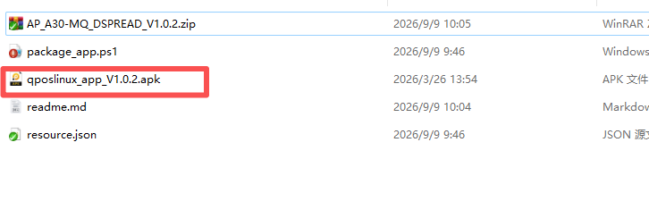
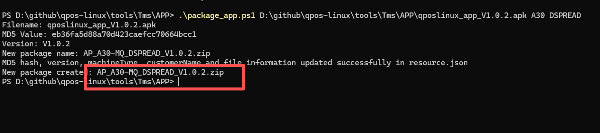

# How to create App ota package

## Explanation

Generating an OTA package requires three important files

- **resource.json**
  
  This file is a configuration file and does not require manual modification.
  
  **<mark>Do not manually modify the kernel content of this file.</mark>**

- **Package script**
  
  **<mark>package_app.ps1</mark>** This is a script file that runs on PowerShell

- **Original File:**
  
  **App Original File**: qposlinux_app_V1.0.2.apk 
  
  <mark>The version number is required when naming the file above. The file suffix type</mark> <mark>should be consistent</mark>

## Create app ota package

- After compiling and packaging the APK file, copy the file to the current folder.Rename the apk file to ***_V1. 0. 1. apk.V1.0. 2 is the actual version number of your app.
  
  

- Open PowerShell and run package_app. ps1. The script requires three parameters to be entered.
  
  1.App file name
  
  2.Device Mode
  
  3.Customer Name
  
  

- After completing the parameter input, press enter to execute the script, which will automatically generate an OTA firmware package that can be uploaded to the TMS system.
  
  

- **AP_A30-MQ_DSPREAD_V1.0.2.zip** It is a generated app ota package that can be uploaded to the TMS system for updating APP.

