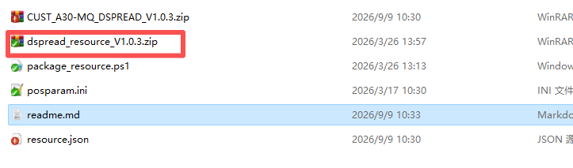
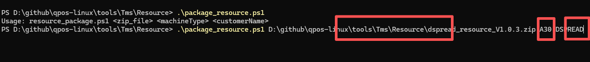
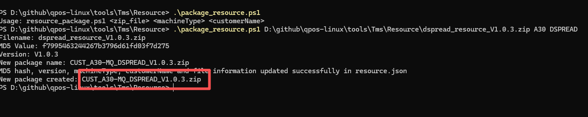

# How to create Resource ota package

## Explanation

Generating an OTA package requires three important files

- **resource.json**
  
  This file is a configuration file and does not require manual modification.
  
  **Do not manually modify the kernel content of this file.**

- **Package script**
  
  **package_resource.ps1** This is a script file that runs on PowerShell

- **Original File:**
  
  **App Original File**: dspread_resource_V1.0.3.zip
  
  You need to package any resource files that need to be updated, such as images, parameter files, certificates, etc., into zip files. After the device downloads the zip file through the TMS system, it will unzip the zip file and place it in res.
  
  The version number is required when naming the file above. The file suffix type should be consistent.

## Create resource ota package

- After  packaging the resource zip file, copy the file to the current folder.Rename the apk file to ***_V1. 0. 3. zip. V1.0. 3 is the actual version number of resource.
  
  

- Open PowerShell and run package_resource. ps1. The script requires three parameters to be entered.
  
  1.Resource zip file name
  
  2.Device Mode
  
  3.Customer Name
  
  

- After completing the parameter input, press enter to execute the script, which will automatically generate an resource ota package that can be uploaded to the TMS system.
  
  

- **CUST_A30-MQ_DSPREAD_V1.0.3.zip** It is a generated resource ota package that can be uploaded to the TMS system for updating  resource.
